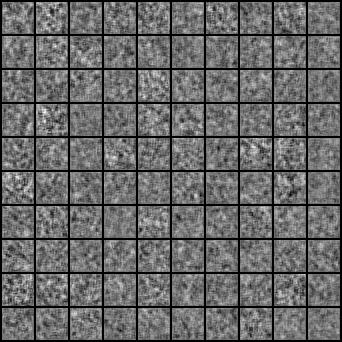

## GAN-PyTorch
Collection of PyTorch implementations of Generative Adversarial Network varieties presented in research papers. Model architectures will not always mirror the ones proposed in the papers, but I have chosen to focus on getting the core ideas covered instead of getting every layer configuration right. Contributions and suggestions of GANs to implement are very welcomed.

## Table of Contents
  * [Installation](#installation)
  * [Implementations](#implementations)
    + [Auxiliary Classifier GAN](#auxiliary-classifier-gan)
    + [Adversarial Autoencoder](#adversarial-autoencoder)
    + [BEGAN](#began)
    + [BicycleGAN](#bicyclegan)
    + [Boundary-Seeking GAN](#boundary-seeking-gan)
    + [Conditional GAN](#conditional-gan)
    + [Context-Conditional GAN](#context-conditional-gan)
    + [Context Encoder](#context-encoder)

## Installation
    $ git clone https://github.com/cpt-r3tr0/GAN-PyTorch.git
    $ cd GAN-PyTorch/
    $ sudo pip3 install -r requirements.txt

## Implementations   
### Auxiliary Classifier GAN
_Auxiliary Classifier Generative Adversarial Network_

#### Authors
Augustus Odena, Christopher Olah, Jonathon Shlens

#### Abstract
Synthesizing high resolution photorealistic images has been a long-standing challenge in machine learning. In this paper we introduce new methods for the improved training of generative adversarial networks (GANs) for image synthesis. We construct a variant of GANs employing label conditioning that results in 128x128 resolution image samples exhibiting global coherence. We expand on previous work for image quality assessment to provide two new analyses for assessing the discriminability and diversity of samples from class-conditional image synthesis models. These analyses demonstrate that high resolution samples provide class information not present in low resolution samples. Across 1000 ImageNet classes, 128x128 samples are more than twice as discriminable as artificially resized 32x32 samples. In addition, 84.7% of the classes have samples exhibiting diversity comparable to real ImageNet data.

[[Paper]](https://arxiv.org/abs/1610.09585) [[Code]](implementations/acgan/acgan.py)

#### Run Example
```
$ cd implementations/acgan/
$ python3 acgan.py
```

<p align="center">
  
</p>

### Adversarial Autoencoder
_Adversarial Autoencoder_

#### Authors
Alireza Makhzani, Jonathon Shlens, Navdeep Jaitly, Ian Goodfellow, Brendan Frey

#### Abstract
n this paper, we propose the "adversarial autoencoder" (AAE), which is a probabilistic autoencoder that uses the recently proposed generative adversarial networks (GAN) to perform variational inference by matching the aggregated posterior of the hidden code vector of the autoencoder with an arbitrary prior distribution. Matching the aggregated posterior to the prior ensures that generating from any part of prior space results in meaningful samples. As a result, the decoder of the adversarial autoencoder learns a deep generative model that maps the imposed prior to the data distribution. We show how the adversarial autoencoder can be used in applications such as semi-supervised classification, disentangling style and content of images, unsupervised clustering, dimensionality reduction and data visualization. We performed experiments on MNIST, Street View House Numbers and Toronto Face datasets and show that adversarial autoencoders achieve competitive results in generative modeling and semi-supervised classification tasks.

[[Paper]](https://arxiv.org/abs/1511.05644) [[Code]](implementations/aae/aae.py)

#### Run Example
    ```
    $ cd implementations/aae/
    $ python3 aae.py
    ```

### BEGAN
_BEGAN: Boundary Equilibrium Generative Adversarial Networks_

#### Authors
David Berthelot, Thomas Schumm, Luke Metz

#### Abstract
We propose a new equilibrium enforcing method paired with a loss derived from the Wasserstein distance for training auto-encoder based Generative Adversarial Networks. This method balances the generator and discriminator during training. Additionally, it provides a new approximate convergence measure, fast and stable training and high visual quality. We also derive a way of controlling the trade-off between image diversity and visual quality. We focus on the image generation task, setting a new milestone in visual quality, even at higher resolutions. This is achieved while using a relatively simple model architecture and a standard training procedure.

[[Paper]](https://arxiv.org/abs/1703.10717) [[Code]](implementations/began/began.py)

#### Run Example
```
$ cd implementations/began/
$ python3 began.py
```

### BicycleGAN
_Toward Multimodal Image-to-Image Translation_

#### Authors
Jun-Yan Zhu, Richard Zhang, Deepak Pathak, Trevor Darrell, Alexei A. Efros, Oliver Wang, Eli Shechtman

#### Abstract
Many image-to-image translation problems are ambiguous, as a single input image may correspond to multiple possible outputs. In this work, we aim to model a \emph{distribution} of possible outputs in a conditional generative modeling setting. The ambiguity of the mapping is distilled in a low-dimensional latent vector, which can be randomly sampled at test time. A generator learns to map the given input, combined with this latent code, to the output. We explicitly encourage the connection between output and the latent code to be invertible. This helps prevent a many-to-one mapping from the latent code to the output during training, also known as the problem of mode collapse, and produces more diverse results. We explore several variants of this approach by employing different training objectives, network architectures, and methods of injecting the latent code. Our proposed method encourages bijective consistency between the latent encoding and output modes. We present a systematic comparison of our method and other variants on both perceptual realism and diversity.

[[Paper]](https://arxiv.org/abs/1711.11586)[[Code]](implementations/bicyclegan/bicyclegan.py)

#### Run Example
```
$ cd data/
$ bash download_pix2pix_dataset.sh edges2shoes
$ cd ../implementations/bicyclegan/
$ python3 bicyclegan.py
```

### Boundary-Seeking GAN
_Boundary-Seeking Generative Adversarial Networks_

#### Authors
R Devon Hjelm, Athul Paul Jacob, Tong Che, Adam Trischler, Kyunghyun Cho, Yoshua Bengio

#### Abstract
Generative adversarial networks (GANs) are a learning framework that rely on training a discriminator to estimate a measure of difference between a target and generated distributions. GANs, as normally formulated, rely on the generated samples being completely differentiable w.r.t. the generative parameters, and thus do not work for discrete data. We introduce a method for training GANs with discrete data that uses the estimated difference measure from the discriminator to compute importance weights for generated samples, thus providing a policy gradient for training the generator. The importance weights have a strong connection to the decision boundary of the discriminator, and we call our method boundary-seeking GANs (BGANs). We demonstrate the effectiveness of the proposed algorithm with discrete image and character-based natural language generation. In addition, the boundary-seeking objective extends to continuous data, which can be used to improve stability of training, and we demonstrate this on Celeba, Large-scale Scene Understanding (LSUN) bedrooms, and Imagenet without conditioning.

[[Paper]](https://arxiv.org/abs/1702.08431) [[Code]](implementations/bgan/bgan.py)

#### Run Example
```
$ cd implementations/bgan/
$ python3 bgan.py
```

### Conditional GAN
_Conditional Generative Adversarial Nets_

#### Authors
Mehdi Mirza, Simon Osindero

#### Abstract
Generative Adversarial Nets [8] were recently introduced as a novel way to train generative models. In this work we introduce the conditional version of generative adversarial nets, which can be constructed by simply feeding the data, y, we wish to condition on to both the generator and discriminator. We show that this model can generate MNIST digits conditioned on class labels. We also illustrate how this model could be used to learn a multi-modal model, and provide preliminary examples of an application to image tagging in which we demonstrate how this approach can generate descriptive tags which are not part of training labels.

[[Paper]](https://arxiv.org/abs/1411.1784) [[Code]](implementations/cgan/cgan.py)

#### Run Example
```
$ cd implementations/cgan/
$ python3 cgan.py
```

<p align="center">
    
</p>

### Context-Conditional GAN
_Semi-Supervised Learning with Context-Conditional Generative Adversarial Networks_

#### Authors
Emily Denton, Sam Gross, Rob Fergus

#### Abstract
We introduce a simple semi-supervised learning approach for images based on in-painting using an adversarial loss. Images with random patches removed are presented to a generator whose task is to fill in the hole, based on the surrounding pixels. The in-painted images are then presented to a discriminator network that judges if they are real (unaltered training images) or not. This task acts as a regularizer for standard supervised training of the discriminator. Using our approach we are able to directly train large VGG-style networks in a semi-supervised fashion. We evaluate on STL-10 and PASCAL datasets, where our approach obtains performance comparable or superior to existing methods.

[[Paper]](https://arxiv.org/abs/1611.06430) [[Code]](implementations/ccgan/ccgan.py)

#### Run Example
    ```
    $ cd implementations/ccgan/
    $ python3 ccgan.py
    ```

### Context Encoder
_Context Encoders: Feature Learning by Inpainting_

#### Authors
Deepak Pathak, Philipp Krahenbuhl, Jeff Donahue, Trevor Darrell, Alexei A. Efros

#### Abstract
We present an unsupervised visual feature learning algorithm driven by context-based pixel prediction. By analogy with auto-encoders, we propose Context Encoders -- a convolutional neural network trained to generate the contents of an arbitrary image region conditioned on its surroundings. In order to succeed at this task, context encoders need to both understand the content of the entire image, as well as produce a plausible hypothesis for the missing part(s). When training context encoders, we have experimented with both a standard pixel-wise reconstruction loss, as well as a reconstruction plus an adversarial loss. The latter produces much sharper results because it can better handle multiple modes in the output. We found that a context encoder learns a representation that captures not just appearance but also the semantics of visual structures. We quantitatively demonstrate the effectiveness of our learned features for CNN pre-training on classification, detection, and segmentation tasks. Furthermore, context encoders can be used for semantic inpainting tasks, either stand-alone or as initialization for non-parametric methods.

[[Paper]](https://arxiv.org/abs/1604.07379) [[Code]](implementations/context_encoder/context_encoder.py)

#### Run Example
    ```
    $ cd implementations/context_encoder/
    <follow steps at the top of context_encoder.py>
    $ python3 context_encoder.py
    ```

<p align="center">
    
</p>

<p align="center">
    Rows: Masked | Inpainted | Original | Masked | Inpainted | Original
</p>
